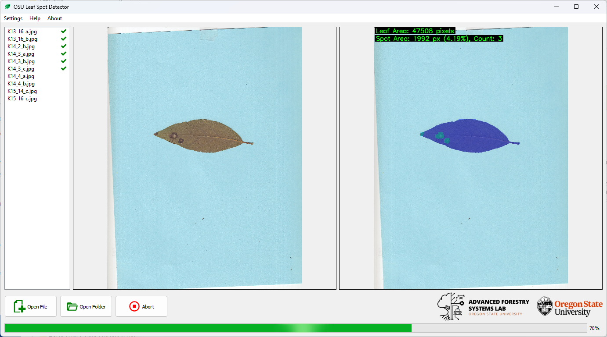

## Septoria Leaf Spot Detector

[](https://opensource.org/licenses/MIT)
[](https://github.com/th00tames1/leafspot/actions/workflows/MultiOS%20Test.yml)
## Introduction

Welcome to **Leaf Spot Detector**! This project is designed to detect the necrotic area on the leaf.

## Key Features

- **User-Friendly Interface:** Provides an intuitive GUI for loading images or folders, and for viewing both original and prediction result images side by side.
- **Advanced YOLO-Based Detection:** Utilizes a YOLO model to accurately detect leaf and spot areas with adjustable thresholds for optimal performance.
- **Comprehensive Reporting & Customization:** Automatically annotates images, generates detailed CSV reports.
- **Batch Processing Capability:** Enables running detection on multiple images at once.

## Installation

If using Anaconda 3, create a clean environment and activate it.  
In Anaconda Prompt, type the following these steps to install the project:
```bash
# Create Conda Environment
conda create -n YOUR_ENVIRONMENT_NAME python==3.10

# Activate Conda Environment
conda activate YOUR_ENVIRONMENT_NAME

# Install the PyPI & git (if there's an error)
conda install pip
conda install git

# Clone the repository
git clone https://github.com/th00tames1/leafspot.git

# Navigate to the project directory
cd leafspot

# Install dependencies
pip install -r requirements.txt
```

## How To Use

It's easy to run!
```bash
python run.py
```
GUI software will appear soon. It may take up to about one minute on the first run.



1. Open Images by click 'Open File' or 'Open Folder'.  
The example images are located in the **'test_images folder'**. Or, you can download by use this google drive link: https://drive.google.com/drive/folders/10MSsa04RvnxVbzmnlWHY5Ggod6un33EV?usp=sharing

2. Click 'Run'.

3. The prediction result images and .csv reports will be saved.


## License

Copyright Heechan Jeong (Advanced Forestry Systems Lab, OSU), 2025.

Distributed under the terms of the MIT license, Leaf Spot Detector is free and open source software.
